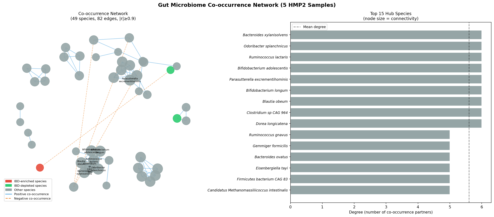
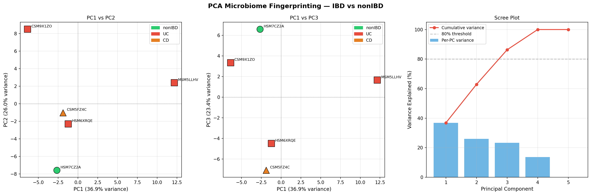
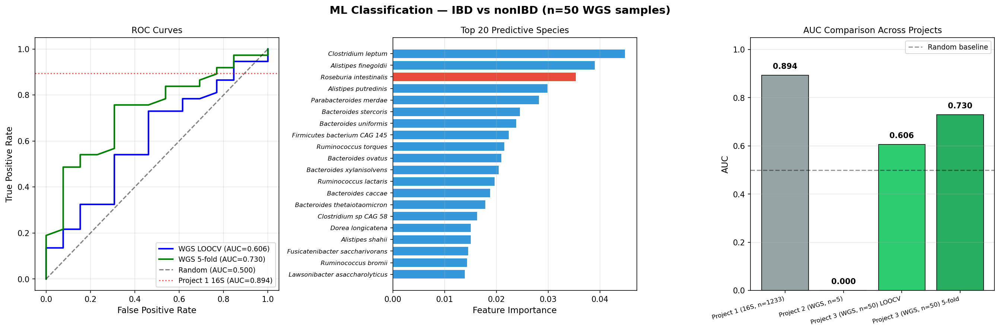
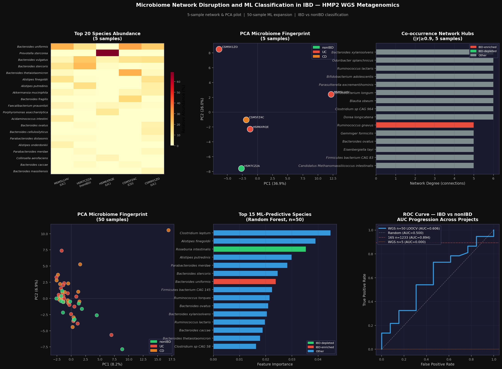

# Microbiome Network Disruption and ML Classification in IBD

Whole-genome shotgun (WGS) metagenomics analysis combining co-occurrence network analysis, PCA microbiome fingerprinting, and machine learning classification using real NIH Human Microbiome Project 2 (HMP2) data.

## Overview

This project directly addresses the core limitation of Project 2 (n=5): expanding to 50 HMP2 samples enables statistically meaningful ML classification. The pipeline adds two new analytical dimensions — microbial co-occurrence network analysis to reveal community structure disruption in IBD, and PCA-based microbiome fingerprinting to visualize disease-associated compositional shifts. Random Forest classification is used to compare WGS-based AUC against the Project 1 16S baseline (AUC = 0.894).

> **Data source:** NIH Human Microbiome Project 2 (HMP2 / iHMP) — real patient WGS metagenomics, pre-computed MetaPhlAn 3.0 profiles

---

## Key Results

| Metric | Value |
|--------|-------|
| Network nodes (species) | 49 |
| Network edges (|r| ≥ 0.9) | 82 |
| Top hub species | *Ruminococcus gnavus*, *Bacteroides xylanisolvens* |
| Top keystone bridge species | *Parasutterella excrementihominis*, *Dorea longicatena* |
| PCA variance explained (PC1–3) | 86.3% |
| PC1 axis drivers | *Escherichia coli*, *Bilophila wadsworthia* (dysbiosis) |
| PC2 axis drivers | *Roseburia intestinalis*, *Ruminococcus bromii* (butyrate producers) |
| ML AUC — WGS n=5 (Project 2) | 0.000 (class imbalance artifact) |
| ML AUC — WGS n=50 LOOCV | **0.606** |
| ML AUC — WGS n=50 5-fold CV | **0.730** |
| ML AUC — 16S n=1,233 (Project 1) | 0.894 (reference) |
| Top ML-predictive species | *Clostridium leptum*, *Roseburia intestinalis*, *Alistipes finegoldii* |

---

## Samples

**Phase 1 — Network & PCA pilot:** 5 HMP2 samples from Project 2

| Sample ID | Diagnosis |
|-----------|-----------|
| HSM7CZ2A | nonIBD (healthy control) |
| MSM5LLHV | UC (Ulcerative Colitis) |
| HSM6XRQE | UC (Ulcerative Colitis) |
| CSM9X1ZO | UC (Ulcerative Colitis) |
| CSM5FZ4C | CD (Crohn's Disease) |

**Phase 2 — ML expansion:** 50 HMP2 samples (baseline visit, one per subject)

| Diagnosis | n |
|-----------|---|
| CD (Crohn's Disease) | 20 |
| UC (Ulcerative Colitis) | 17 |
| nonIBD (healthy control) | 13 |

---

## Repository Structure

```
IBD-metagenomics-project3/
├── scripts/
│   ├── 01_build_species_matrix.py        # Parse MetaPhlAn profiles → abundance matrix
│   ├── 02_network_analysis.py            # Co-occurrence network (Spearman, |r|≥0.9)
│   ├── 03_pca_fingerprinting.py          # PCA microbiome fingerprinting
│   ├── 04_download_hmp2_profiles.py      # Download & filter HMP2 merged taxonomic table
│   ├── 05_machine_learning_50.py         # Random Forest LOOCV + 5-fold CV (n=50)
│   └── 06_final_dashboard.py             # 6-panel comprehensive dashboard figure
├── data/
│   ├── project2_samples/                 # Symlink to Project 2 per-sample files
│   ├── hmp2_metaphlan_merged.tsv         # HMP2 merged MetaPhlAn 3.0 profiles (not tracked)
│   └── target_samples.csv               # 50 selected sample IDs with diagnosis labels
├── results/
│   ├── species_abundance_matrix.tsv      # 5-sample species matrix
│   ├── species_matrix_50samples.tsv      # 50-sample species matrix
│   ├── species_correlation_matrix.tsv    # Spearman correlation matrix (58×58)
│   ├── network_metrics.tsv              # Degree, betweenness, closeness per species
│   ├── pca_loadings.tsv                 # PCA species loadings
│   ├── pca_coordinates.tsv              # Per-sample PCA coordinates
│   ├── feature_importances_50.tsv       # RF feature importances (n=50)
│   └── ml_comparison.tsv               # AUC comparison across projects
├── figures/
│   ├── network_analysis.png             # Network graph + hub species bar chart
│   ├── pca_fingerprinting.png           # PCA panels + scree plot
│   ├── ml_classification_50.png         # ROC curves + feature importances + AUC comparison
│   └── final_dashboard.png              # 6-panel comprehensive dashboard
├── environment.yml
├── DATA_DOWNLOAD.md
├── PROJECT_SUMMARY.md
└── README.md
```

---

## Figures

### Co-occurrence Network Analysis


### PCA Microbiome Fingerprinting


### ML Classification — ROC & Feature Importances


### Final Dashboard


---

## Setup

### 1. Clone the repository

```bash
git clone https://github.com/YOUR_USERNAME/IBD-metagenomics-project3.git
cd IBD-metagenomics-project3
```

### 2. Create the conda environment

```bash
conda env create -f environment.yml
conda activate metagenomics
```

### 3. Download HMP2 data

See [DATA_DOWNLOAD.md](DATA_DOWNLOAD.md) for instructions on obtaining the MetaPhlAn merged profiles from the HMP2 portal.

### 4. Run the pipeline

Scripts are numbered and designed to run in order:

```bash
python scripts/01_build_species_matrix.py
python scripts/02_network_analysis.py
python scripts/03_pca_fingerprinting.py
python scripts/04_download_hmp2_profiles.py
python scripts/05_machine_learning_50.py
python scripts/06_final_dashboard.py
```

---

## Analysis Pipeline

| Script | Analysis | Key Output |
|--------|----------|------------|
| `01` | Parse MetaPhlAn profiles, build abundance matrix | 5×109 species matrix |
| `02` | Spearman co-occurrence network (|r|≥0.9) | Network graph, hub & keystone species |
| `03` | PCA microbiome fingerprinting | 3-panel PCA figure, species loadings |
| `04` | Download & filter HMP2 merged table to 50 samples | 50×578 species matrix |
| `05` | Random Forest LOOCV + 5-fold CV, IBD vs nonIBD | AUC comparison table, ROC curves |
| `06` | 6-panel comprehensive dashboard | `final_dashboard.png` |

---

## Scientific Findings

### Co-occurrence Network
- 49 species connected by 82 edges (|r| ≥ 0.9) across 5 samples
- 13 connected components — fragmented community structure consistent with IBD dysbiosis
- High clustering coefficient (0.703) indicates tight within-guild co-occurrence
- **Hub species:** *Ruminococcus gnavus* (degree=5) — known IBD-associated species linked to flares
- **Keystone bridge species:** *Parasutterella excrementihominis* and *Dorea longicatena* — connect otherwise isolated community guilds

### PCA Fingerprinting
- PC1–3 explain 86.3% of total variance — community structure well-captured in 3 dimensions
- **PC1 (36.9%) — Dysbiosis axis:** driven by *E. coli*, *Bilophila wadsworthia*, *Hungatella hathewayi* — all IBD-associated pathobionts
- **PC2 (26.0%) — Protective microbiome axis:** driven by *Roseburia intestinalis*, *Ruminococcus bromii*, *Eubacterium eligens* — butyrate producers depleted in IBD
- Healthy nonIBD sample (HSM7CZ2A) separates clearly from IBD samples on PC1

### Machine Learning Classification (n=50)
- Random Forest with LOOCV: AUC = **0.606** (above chance; n=5 was 0.000)
- Random Forest with 5-fold CV: AUC = **0.730**
- Improvement from n=5 → n=50 confirms sample size was the limiting factor in Project 2
- Gap to Project 1 (AUC=0.894) explained by 16S cohort being 25× larger (n=1,233)
- **Top predictive species:** *Clostridium leptum*, *Roseburia intestinalis*, *Alistipes finegoldii* — butyrate-related taxa with established IBD literature support

---

## Comparison Across Projects

| Project | Data | n | AUC | Novel contribution |
|---------|------|---|-----|--------------------|
| Project 1 | 16S amplicon | 1,233 | 0.894 | Large-scale classifier, genus-level |
| Project 2 | WGS metagenomics | 5 | 0.000 | Species/strain/function resolution |
| **Project 3** | **WGS metagenomics** | **50** | **0.730** | **Network analysis + expanded ML** |

---

## Environment

- **OS:** Ubuntu 22.04 (WSL2)
- **Conda environment:** `metagenomics`
- **Python:** 3.10
- **Key libraries:** networkx, scikit-learn, scipy, pandas, matplotlib, seaborn

---

## Limitations

- **n=50** — still modest; AUC gap to Project 1 is primarily a sample size effect
- **Pre-computed MetaPhlAn 3.0 profiles** used — raw FASTQ processing not performed
- **Network analysis on n=5** — fragmentation pattern is preliminary; requires larger n for confirmation
- **One timepoint per subject** — longitudinal dynamics not captured

---

## License

MIT License. Data derived from the NIH HMP2 study — see DATA_DOWNLOAD.md for data use terms.
